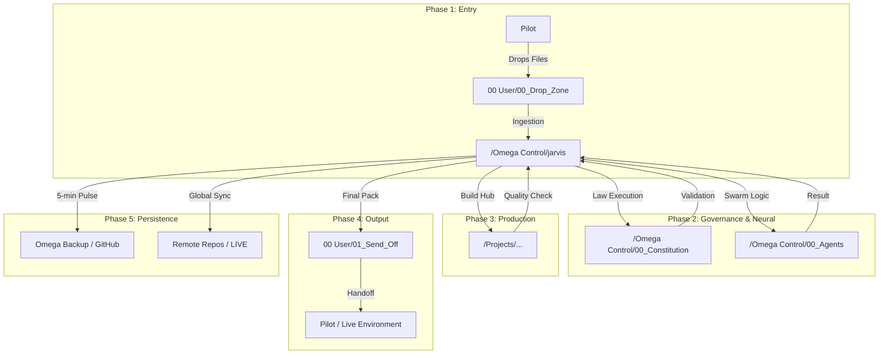

# 🗺️ OMEGA SYSTEM FLOW MAP (UNIFIED)



### 🧭 Navigation Sovereignty
- **Primary Hub**: [Omega Control](file:///Volumes/Internal/Projects/Omega%20System/Omega%20Control/)
- **Production Skeleton**: [Projects](file:///Volumes/Internal/Projects/Omega%20System/Projects/)
- **Input/Output**: [00_Drop_Zone](file:///Volumes/Internal/Projects/Omega%20System/00%20User/00_Drop_Zone/) | [01_Send_Off](file:///Volumes/Internal/Projects/Omega%20System/00%20User/01_Send_Off/)
```
